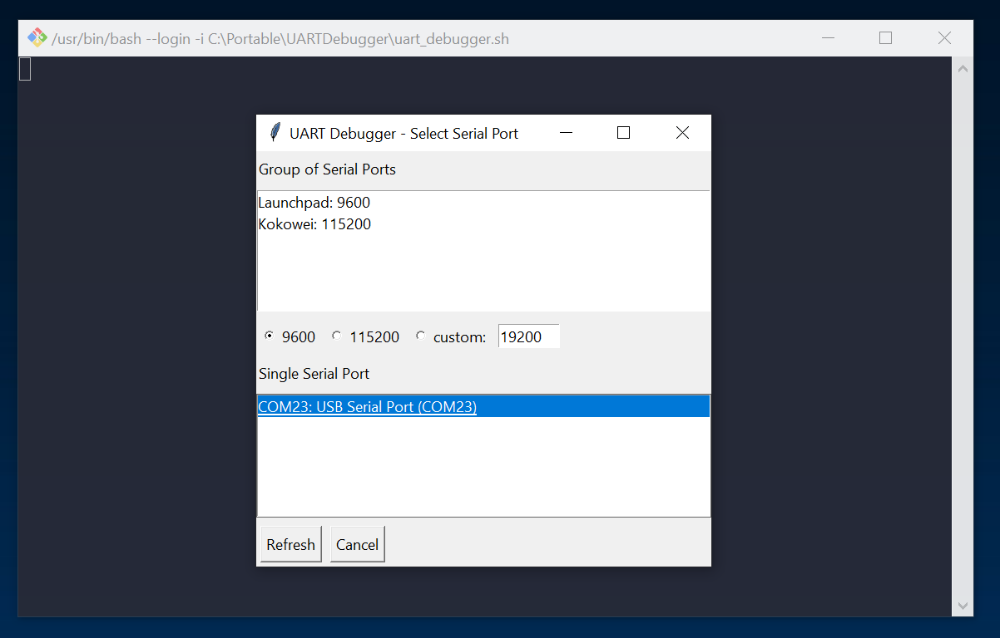

# UARTDebugger

## Introduction
When programming my microcontrollers I typically use the COM ports to output debug information. Programming wireless mircocontrollers I typical unplug boards after programming. PuTTY makes it hard to watch serial communication because the window closes after disconnect.

This program can watch multiple COM ports at a time. On disconnect, the program is not closed. It tries to reconnect to the device when present. The colored output is used for better visualization.

## Installation
- Install a version of Python 3: <https://www.python.org/>
- Make sure that Python is registered in the Windows PATH variable.
- Install dependencies: `pip install -r requirements.txt`
- Preferred Terminal:
  - Windows CMD: use *uart_debugger.bat*
  - Git Bash / Linux: use *uart_debugger.sh*

## Configuration
- Edit the `config.py` file
- See the comments for description of the settings
- Optional: Add a link to your Programs List